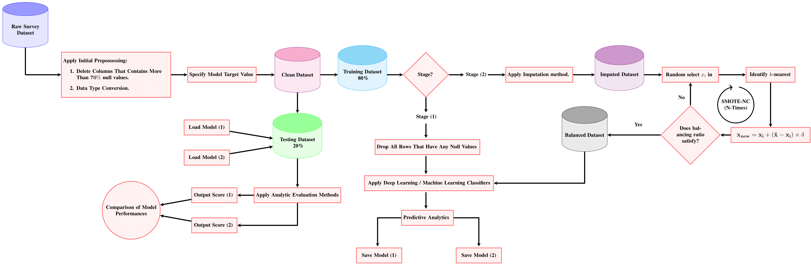

# Comprehensive-prediction-analysis-of-alcohol-and-drug-use-disorder-using-machine-deep-learning-algor
This repository represents our work in the paper `Comprehensive prediction analysis of alcohol and drug use disorder using machine/deep learning algorithms` 

# The first pre-processing of our dataset
This is initial-processing step.  Start the notebook server from the command line:

``bash
jupyter notebook
``

See (initial-preprocessing/Cleaned the data (initial pre-processing)). 
